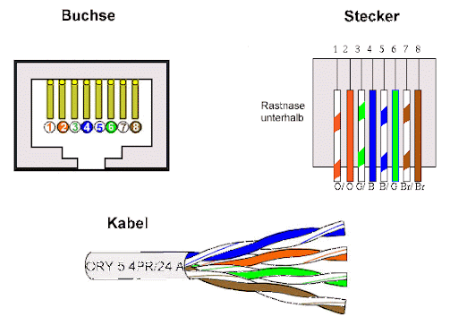

#CAN <-> RJ45 Adapter

## Belegung HTL Wels (WOEA) Adapter

Adapter Pin |Funktion |Farbe
|-----------|---------|-----
| 1         | CAN_H   |Grün
| 2         | CAN_L   |Gelb
| 7,8       | GND     |Schwarz, Braun

## Gängige Belegung bei Industrieanwendungen

| **Pin** | **Signal**    |
|---------|---------------|
| 1       | CAN_H         |
| 2       | CAN_L         |
| 3       | GND           |
| 4       | (optional) V+ |
| 5       | (optional) V+ |
| 6       | GND           |
| 7       | Reserve       |
| 8       | Reserve       |